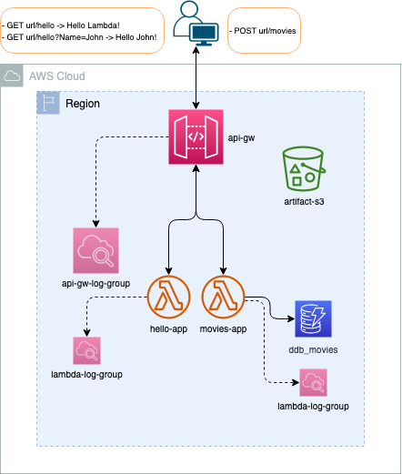

# AWS Terraform ServerLess Example

The purpose of this repository is to provide an end-to-end AWS API ServerLess infrastructure, the `infrastructure-as-code` has been done with Terraform, coded in a modular way, the components are:
- [s3 bucket](https://registry.terraform.io/providers/hashicorp/aws/latest/docs/resources/s3_bucket) for storing the lambda artifacts
- [api_gateway](https://registry.terraform.io/providers/hashicorp/aws/latest/docs/resources/apigatewayv2_api) version 2 and its components:
    - stage
    - integration
    - route
    - cloudwatch log group
- [lambda](https://registry.terraform.io/providers/hashicorp/aws/latest/docs/resources/lambda_function) using Python, lambda components:
    - IAM Role and Policy
    - Lambda Permission
    - cloudwatch log group
    - Dynamo DB Table

The Infrastructure diagram:


The pattern used for the infrastructure as code is the following:
- `Cloudformation:` [template](cloudformation/template.yaml), only containing the minimum requirement of AWS Infrastrcture for Terraform [remote state](https://www.terraform.io/language/state/remote).
- `Terraform:` Code groupped into [terraform](terraform) folder in a modular way to simplify the variables declaration as well as common objects to be used along modules definition, where in a single [main.tf](terraform/main.tf) all the infrastructure is pointed, so `Cloudformation deploy is a requirement for any Terraform target`.

**Requirements:**
- [docker](https://docs.docker.com/get-docker/)
- [docker-cicd-image](https://github.com/leandro-mana/docker-cicd-image) for an end-to-end local development environment, otherwise, `python3.8`, `terraform`, `aws-cli` needs to be setup. The `cicd-image` also contains a `deploy` script that makes very simple to use Terraform for remote state, outputs, plans, deploy and destroy, as well as Cloudformation for the base static infrastructure, all of this triggered via [Makefile](Makefile)
- `GNU Make 4.3` 

- Environment Variables:
    - `AWS_ACCOUNT_ID`: The AWS Account Id to deploy the infra
    - `AWS_DEFAULT_REGION`: The AWS Account Default Region
    - `AWS_ACCESS_KEY_ID`: The AWS API Access Key ID  
    - `AWS_SECRET_ACCESS_KEY`: The AWS API Access Secret Key
## Setup and Run

Once the `cicd-docker-image` is built and `Make` installed, follow bellow for a complete execution flow:

```Bash
# 1 - Export the minimum AWS Envrionment variables specified above
export AWS_ACCOUNT_ID=<...>
export AWS_DEFAULT_REGION=<...>
export AWS_ACCESS_KEY_ID=<...>  
export AWS_SECRET_ACCESS_KEY=<...>

# 2 - Make Help Target Message
make [help]

# 3 - Docker run, this will:
#   - Mount the repository into CICD Docker Image
#   - Add the AWS Context
make cicd_local_env

# 4 - Once inside Docker
#   - Setup Python Virtual Environment
#   - Check code quality, check and tests
python -m venv .venv && source .venv/bin/activate
pip install --upgrade pip && pip install -r requirements.txt
make test

# 5 - Deploy Cloudformation in dev
make cfn/deploy/dev

# 6 - Terraform plan
make tf/plan/dev

# 7 - Terraform deploy
 make tf/deploy/dev

# Terraform output like
hello_app_base_url = "https://<hash>.execute-api.<region>.amazonaws.com/hello_app-stage"

# 8 - API invoke and output
curl "https://<hash>.execute-api.<region>.amazonaws.com/hello_app-stage/hello"

-> "Hello Lambda!"

curl -X POST "https://<hash>.execute-api.<region>.amazonaws.com/movies_app-stage/movies"

-> {"message": "Successfully inserted data!"}

# 9 - API Inkoke with argument and output
curl "https://<hash>.execute-api.<region>.amazonaws.com/hello_app-stage/hello?Name=Leo"

-> "Hello Leo!"

curl -X POST "https://<hash>.execute-api.<region>.amazonaws.com/movies_app-stage/movies" \
    --header 'Content-Type: application/json' \
    -d '{"year":1977, "title":"Starwars"}'

-> {"message": "Successfully inserted data!"}

# 10 - if at any point the hello_app_base_url is needed, run
make tf/output/dev

# 11 - Destroy
make tf/destroy/dev
```

This example can be extended to different `environments` by adding the respective configuration in [cloudformation config](cloudformation/config/) and [terraform config](terraform/config/), then using as the flow shown above, changing the `<env>` in the Make target for the corresponding name.

The [mypy](http://mypy-lang.org/) and the [pytest](https://docs.pytest.org/) configuration is scalable for a real project, but the unit tests added into the [test](./test/) folder is to show how to store them along with the configuration but are just an example of assertions.

**NOTE:** To `destroy Cloudformation`, do it via the AWS Web Console, as the infrastructure defined in there implies an S3 Bucket, that has a Retain policy, plus it needs to be emptied before deletion. This is done for security reasons to simulate a production environment in where the Terraform states needs to be preserved. Regarding the AWS Environmental variables, when used in CICD, like [Github Actions](https://docs.github.com/en/actions), should be an [environment secret](https://docs.github.com/en/actions/deployment/targeting-different-environments/using-environments-for-deployment), to use the same names on different environments.

**Contact:** [Leandro Mana](https://www.linkedin.com/in/leandro-mana-2854553b/)
